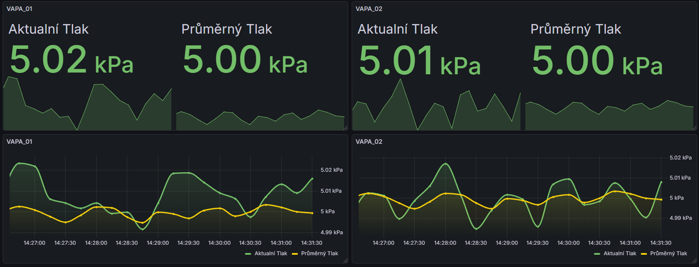
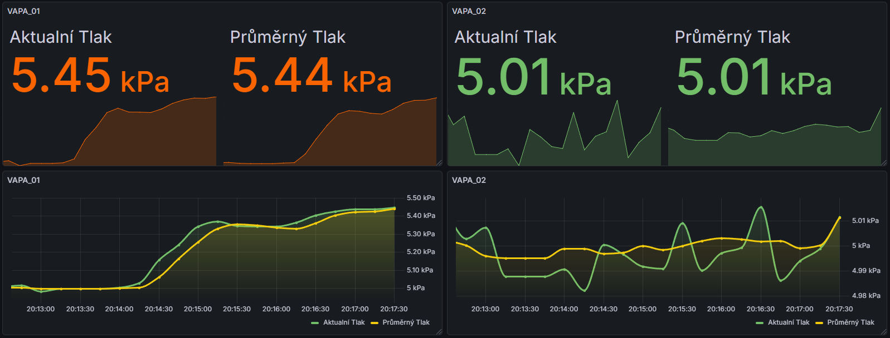
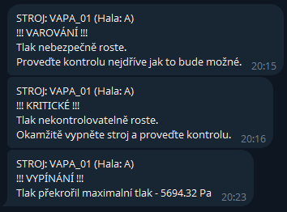
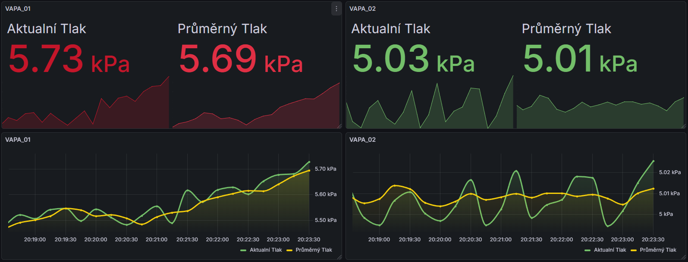

# Industrial Pressure Monitoring System 🏭

A professional IoT monitoring solution for vacuum coating machines. This system features real-time data processing, anomaly detection, and automated alerting via Telegram.

## 🚀 Key Features
* **Real-time Telemetry:** Full integration with Prometheus and Grafana for live monitoring.
* **Statistical Intelligence:** Uses moving averages and medians to filter sensor noise and detect leaks.
* **Automated Incident Response:** Escalates notifications from Notice to Emergency Shutdown based on severity.
* **Ready for Production:** Fully containerized using Docker and Docker Compose.

## 📊 Case Study: Incident Lifecycle
This demonstration shows how the system reacts to a simulated pressure leak on machine **VAPA_01**.

| Phase | System Visualization | Technical Description |
| :--- | :--- | :--- |
| **1. Normal** |  | The system maintains a stable pressure of 5000 Pa. The logic filters out minor fluctuations. |
| **2. Anomaly** |  | A leak is detected. The moving average (yellow) begins to deviate as the trend is identified. |
| **3. Alerting** |  | Automatic escalation: Warning and Critical alerts sent via Telegram API. |
| **4. Shutdown** |  | Emergency threshold (5.73 kPa) reached. The "Brain" triggers a safety STOP state. |

## 🛠 Tech Stack
* **Python 3.11** (NumPy for math, Prometheus Client, Requests)
* **Docker & Docker Compose** (Container orchestration)
* **Prometheus & Grafana** (Metrics storage and visualization)

## 🏗 Setup
To run the entire stack:
```bash
docker-compose up --build -d
